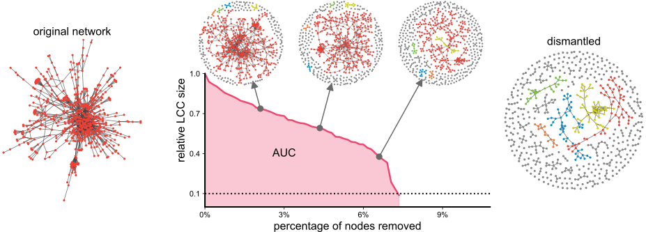

# Learning Network Dismantling without Handcrafted Inputs

<div style="text-align:center;">
  <br>
  <div style="display:inline-block; text-align:justify; width:800px; padding-bottom:30px;">
    <sub>
      <b>Network dismantling</b> seeks a sequence of node removals that fragments a network as rapidly as possible into disconnected components. Here, the dismantling of a <a href="https://dl.acm.org/doi/abs/10.1145/2856037">social network</a> is illustrated, where we sequentially remove nodes and record the size of the largest connected component (LCC) after each removal. The objective of network dismantling is to minimize the area under the LCC curve (AUC).
    </sub>
  </div>
</div>

&nbsp;

This is the official implementation of the network dismantling algorithm, MIND, in *Learning Network Dismantling without Handcrafted Inputs* (accepted by AAAI 2026 for oral presentation). You can find the full paper [**here**](https://arxiv.org/abs/2508.00706). If you find this repo useful, please cite us:

```
@article{tian2025learning,
  title={Learning Network Dismantling without Handcrafted Inputs},
  author={Tian, Haozhe and Ferraro, Pietro and Shorten, Robert and Jalili, Mahdi and Hamedmoghadam, Homayoun},
  journal={arXiv preprint arXiv:2508.00706},
  year={2025}
}
```

## Configuration

This implementation was tested on Ubuntu 22.04. To set up the `conda` environment, navigate to the repository directory and run the following commands:

```bash
conda env create -f environment.yml
conda activate mind_nd

# install torch-scatter
pip install torch-scatter -f https://data.pyg.org/whl/torch-2.4.1+cu124.html

# install PyG
pip install torch_geometric
```


## Quick visualization

We provide a notebook [`visualize.ipynb`](visualize.ipynb) for visualizing the dismantling process of networks. To visualize your own networks, save your `igraph.Graph` object as a `.pkl` file in a target folder and specify that folder path when initializing the environment in the notebook, as shown below:
```python
# for large networks, set render to False
env = DismantleEnv('your_folder_here', batch_size=5, is_val=True, render='plot')
```


## Dismantle Custom Networks

To dismantle custom networks and compute the AUC, place your network files in a directory (e.g., `graphs/example`) and run the following command. The results will be saved as a `.csv` file in the `results` directory.

```bash
python test.py --device cuda --ckpt_pth saved/mind.ckpt --directory graphs/example
```

## Dismantle Real Networks

Run the following command to dismantle all real networks in `graphs/real`. Note that this process is computationally intensive (due to large networks with millions of nodes) and may take several days on a GPU.

```bash
python test.py --device cuda --ckpt_pth saved/mind.ckpt --directory graphs/real
```
